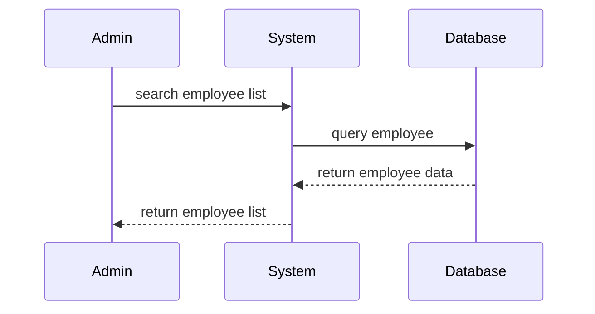
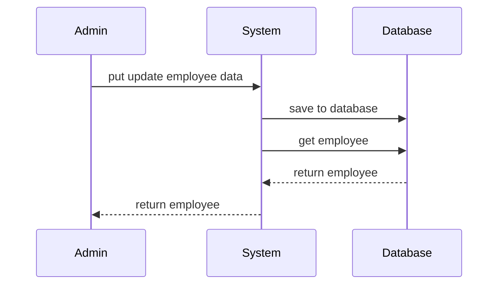

## GET - Employee List

	/api/admin/employees
	


**Parameters**
|Name|Type|Mandatory|Description
|--|--|--|--|
|search|string|no|
|employeeStatus|string|no|
|percentLogMin|number|no|
|percentLogMax|number|no|
|lineManager|array|no|
|site|array|no|
|submittedOnly|boolean|no|
|month|string|no|
|years|number|no|
|sort|string|no|
|sortDir|string|no|ASC, DESC
|page|number|no|
|pageSize|number|no|

**Response  - 200**
 ``` json
{
	"content": [
		{
			"uuid": "6034be7b-a132-4ad9-b571-e3a4f16c572b",
			"firstName": "joe",
			"lastName": "biden",
			"email": "joe@scoutout.net",
			"phone": "0812345678",
			"lineManagerUuid": "6034be7b-a132-4ad9-b571-e3a4f16c572b",
			"lineManagerName": "Som",
			"siteUuid": "6034be7b-a132-4ad9-b571-e3a4f16c572b",
			"siteName": "SCB",
			"logPercent": 100,
			"status": "ACTIVE",
			"lastActiveDateTime": "2023-10-02T13:39:36.936Z",
			"createdDateTime": "2023-10-02T13:39:36.936Z"
	    },
	    {
			"uuid": "6034be7b-a132-4ad9-b571-e3a4f16c572b",
			"firstName": "poo",
			"lastName": "tin",
			"email": "joe@scoutout.net",
			"phone": "0812345678",
			"lineManagerUuid": "6034be7b-a132-4ad9-b571-e3a4f16c572b",
			"lineManagerName": "Bee",
			"siteUuid": "6034be7b-a132-4ad9-b571-e3a4f16c572b",
			"siteName": "KTB",
			"logPercent": 70,
			"status": "ACTIVE",
			"lastActiveDateTime": "2023-10-02T13:39:36.936Z",
			"createdDateTime": "2023-10-02T13:39:36.936Z"
	    },
	]
	"totalElements": 48,
	"totalPages": 5,
	"size": 10,
}
```


## PUT -  Update Employee 

	/api/admin/employee/{employeeUuid}
	


**Parameters**
|Name|Type|Mandatory|Description
|--|--|--|--|
|firstName|string|yes|
|lastName|string|yes|
|email|string|yes|
|phone|string|yes|
|lineManagerUuid|string|yes|
|siteUuid|string|yes|
|status|string|yes| ACTIVE, INACTIVE, RESIGN, CONTRACT_EXPIRED

**Response - 200**
 ``` json
{
	"uuid": "6034be7b-a132-4ad9-b571-e3a4f16c572b",
	"firstName": "joe",
	"lastName": "biden",
	"email": "joe@scoutout.net",
	"phone": "0812345678",
	"lineManagerUuid": "6034be7b-a132-4ad9-b571-e3a4f16c572b",
	"lineManagerName": "Som",
	"siteUuid": "6034be7b-a132-4ad9-b571-e3a4f16c572b",
	"siteName": "SCB",
	"logPercent": 100,
	"status": "ACTIVE",
	"lastActiveDateTime": "2023-10-02T13:39:36.936Z",
	"createdDateTime": "2023-10-02T13:39:36.936Z"
}
```


## PUT -  Update Employee Status

	/api/admin/employee/{employeeUuid}/status

**Parameters**
|Name|Type|Mandatory|Description
|--|--|--|--|
|status|string|yes|ACTIVE, INACTIVE, RESIGN, CONTRACT_EXPIRED

**Response - 200**
 ``` json
{
	"uuid": "6034be7b-a132-4ad9-b571-e3a4f16c572b",
	"firstName": "joe",
	"lastName": "biden",
	"email": "joe@scoutout.net",
	"phone": "0812345678",
	"lineManagerUuid": "6034be7b-a132-4ad9-b571-e3a4f16c572b",
	"lineManagerName": "Som",
	"siteUuid": "6034be7b-a132-4ad9-b571-e3a4f16c572b",
	"siteName": "SCB",
	"logPercent": 100,
	"status": "ACTIVE",
	"lastActiveDateTime": "2023-10-02T13:39:36.936Z",
	"createdDateTime": "2023-10-02T13:39:36.936Z"
}
```


## GET -  Line Manager Dashboard 

	/api/admin/dashboard/linemanager

**Parameters**
|Name|Type|Mandatory|Description
|--|--|--|--|
|lineManager|string|no|
|month|string|no|
|years|number|no|
|sort|string|no|
|sortDir|string|no|ASC, DESC
|page|number|no|
|pageSize|number|no|

**Response  - 200**
 ``` json
{
	"content": [
		{
			"uuid": "6034be7b-a132-4ad9-b571-e3a4f16c572b",
			"lineManagerName": "Som",
			"notCompleted": 100,
			"completed": 900,
			"totalEmployee": 1000,
			"status": "ACTIVE",
			"lastActiveDateTime": "2023-10-02T13:39:36.936Z",
			"createdDateTime": "2023-10-02T13:39:36.936Z"
	    },
	    {
			"uuid": "6034be7b-a132-4ad9-b571-e3a4f16c572b",
			"lineManagerName": "Bee",
			"notCompleted": 500,
			"completed": 1500,
			"totalEmployee": 2000,
			"status": "ACTIVE",
			"lastActiveDateTime": "2023-10-02T13:39:36.936Z",
			"createdDateTime": "2023-10-02T13:39:36.936Z"
	    }
	]
	"totalElements": 48,
	"totalPages": 5,
	"size": 10,
}
```


## GET -  Line Manager Dashboard 

	/api/admin/dashboard/site

**Parameters**
|Name|Type|Mandatory|Description
|--|--|--|--|
lineManager|string|no|
|month|string|no|
|years|number|no|
|sort|string|no|
|sortDir|string|no|ASC, DESC
|page|number|no|
|pageSize|number|no|

**Response  - 200**
 ``` json
{
	"content": [
		{
			"uuid": "6034be7b-a132-4ad9-b571-e3a4f16c572b",
			"site": "SCB",
			"lineManagerUuid": "6034be7b-a132-4ad9-b571-e3a4f16c572b",
			"lineManagerName": "Som",
			"notCompleted": 10,
			"completed": 90,
			"totalEmployee": 100,
			"status": "ACTIVE",
			"lastActiveDateTime": "2023-10-02T13:39:36.936Z",
			"createdDateTime": "2023-10-02T13:39:36.936Z"
	    },
	    {
			"uuid": "6034be7b-a132-4ad9-b571-e3a4f16c572b",
			"site": "KTB",
			"lineManagerUuid": "6034be7b-a132-4ad9-b571-e3a4f16c572b",
			"lineManagerName": "Som",
			"notCompleted": 10,
			"completed": 90,
			"totalEmployee": 100,
			"status": "ACTIVE",
			"lastActiveDateTime": "2023-10-02T13:39:36.936Z",
			"createdDateTime": "2023-10-02T13:39:36.936Z"
	    }
	]
	"totalElements": 48,
	"totalPages": 5,
	"size": 10,
}
```


## GET -  Line Managers 

	/api/admin/linemanegers


**Parameters**
|Name|Type|Mandatory|Description
|--|--|--|--|
|||

**Response  - 200**
 ``` json
[
	{
		"id": 1,
		"lineManager": "k.Som"
	},
	{
		"id": 2,
		"lineManager": "k.Bee"
	},
	{
		"id": 3,
		"lineManager": "line manager name"
	}
]
```


## GET -  Sites

	/api/admin/sites


**Parameters**
|Name|Type|Mandatory|Description
|--|--|--|--|
|||

**Response  - 200**
 ``` json
[
	{
		"id": 1,
		"site": "SCB"
	},
	{
		"id": 2,
		"site": "KTB"
	},
	{
		"id": 3,
		"site": "KBANK"
	}
]
```


<!--stackedit_data:
eyJoaXN0b3J5IjpbNTk4NTAyNzRdfQ==
-->